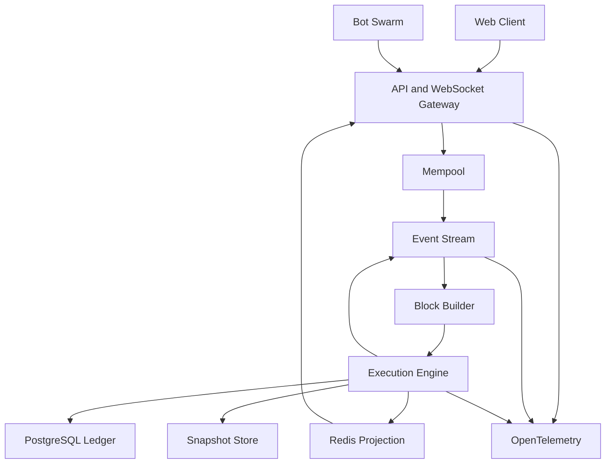

# MEV Arena — Product & Technical Specification

- Document status: Draft v0.1
- Project type: Real-time Web3 market-structure simulation and large-scale systems portfolio
- Suggested schedule: 8 weeks, 6–8 hours per week
- Repository: `mev-arena`

## 1. One-line definition

MEV Arena is an educational game and simulator that shows, in real time, thousands of virtual traders and strategy bots competing in a public mempool, and how AMM execution results change depending on the block builder's transaction ordering.

## 2. Problem

MEV, priority fees, sandwich attacks, slippage, and transaction ordering are hard to understand from text or static diagrams alone. Users should be able to observe a transaction from the moment it enters the mempool until it is included in a block and executed, and change ordering policies and bot strategies to compare the outcomes directly.

The portfolio goal of this project is to present the following abilities as runnable evidence:

- Real-time event-driven system design
- Handling ordering, duplication, and concurrency problems
- Deterministic state execution and event replay
- Kafka partitioning and backpressure
- Separating a PostgreSQL ledger from Redis projections
- WebSocket fan-out
- Load testing, saturation-point discovery, and failure recovery
- OpenTelemetry-based observability
- Designing the Web3 execution and settlement boundary

## 3. Target users

### Primary

- Backend/Web3 developers learning how MEV and AMMs behave
- Students who want to see the impact of transaction ordering visually
- Engineers reviewing a system-design / real-time-architecture portfolio

### Secondary

- Developers who want to implement and compare simple bot strategies
- Distributed-systems learners who want to reproduce load and failure scenarios

## 4. Core user experience

1. The user starts the Arena.
2. The user enables Noise Trader, Arbitrage Bot, and Sandwich Bot.
3. Transactions accumulate in a real-time mempool.
4. Every 3 seconds the block builder selects and orders transactions according to its policy.
5. The execution engine executes the transactions sequentially.
6. AMM price, user slippage, bot P&L, and block state are updated.
7. The user changes the ordering policy and replays the same input.
8. The user compares the differences in results and traces.

## 5. v0.1 scope

### Market and execution

- Two virtual tokens: `BASE`, `QUOTE`
- Constant-product AMM: `x * y = k`
- Fixed-point or integer-based amount arithmetic
- Swap exact-in
- Slippage limit
- Virtual priority fee
- Account nonce
- Block production every 3 seconds
- Maximum number of transactions per block (the equivalent of block gas/capacity)

### Bots

- `NoiseTrader`: generates swaps of random direction and size
- `ArbitrageBot`: exploits the gap between an external reference price and the AMM price
- `SandwichBot`: detects large swaps and generates front- and back-running transactions
- Per-bot seed configuration and deterministic execution

### Visualization

- Real-time AMM price chart
- Mempool list
- Countdown to the next block
- Transaction order inside a block
- Execution result per transaction
- Slippage per user and P&L per bot
- Pause, step, replay, speed control

### Operations and verification

- OpenTelemetry traces and metrics
- k6 or a dedicated bot-swarm load generator
- Prometheus/Grafana dashboards
- Snapshots and event replay
- One-command Docker Compose run

## 6. Explicit non-goals

v0.1 does not implement:

- Real assets or mainnet transactions
- Real wallet connections or custody of funds
- A full Ethereum consensus/EVM reimplementation
- NFTs, DAOs, bridges, ZK proofs
- Multichain
- Complex DeFi products such as perpetuals, lending, liquidation
- Trading bots that guarantee real profit
- Kubernetes as a required execution path
- A separate database per microservice

## 7. System architecture



### Deployment strategy

Start as a modular monolith. Keep the module boundaries below at the code level, but do not split deployment units until load testing confirms a need for independent scaling.

- gateway
- mempool
- block-builder
- execution-engine
- projection
- bot-swarm
- observability

In v0.2, only components with a confirmed bottleneck are split into independent processes.

## 8. Component responsibilities

### API / WebSocket Gateway

- Accept transaction submissions
- Input validation and rate limiting
- Idempotency-key handling
- Push real-time market/block events
- Bounded buffer and disconnect for slow WebSocket clients

### Mempool

- Transaction de-duplication
- Account nonce validation
- Enforce a maximum queue size
- Keep priority fee and arrival sequence
- Evict expired transactions
- Provide an immutable candidate set to the block builder

### Block Builder

- FIFO, priority-fee, random, and adversarial ordering strategies
- Select transactions within block capacity
- Produce the same block from the same input and seed
- Carry unselected transactions over to the next block

### Execution Engine

- Sequential, deterministic transaction execution
- Update AMM price and balances
- Validate slippage and balances
- Produce success/failure execution receipts
- Compute the state hash
- Publish domain events

### Projection

- Build latest price, leaderboard, and mempool summary
- Rebuildable from the ledger and event log after a Redis failure
- Projections are never the source of truth

### Snapshot / Replay

- Save a world-state snapshot every N blocks
- Restore state by reapplying events recorded after the snapshot
- Verify the state hash of the replay result

## 9. Data model

### Transaction

```text
id
idempotency_key
account_id
nonce
market_id
side
amount_in
min_amount_out
priority_fee
submitted_at
expires_at
status
```

### Block

```text
height
parent_hash
block_hash
builder_policy
simulation_seed
opened_at
committed_at
state_root
```

### ExecutionReceipt

```text
transaction_id
block_height
position
status
amount_in
amount_out
effective_price
slippage_bps
fee_paid
error_code
```

### AccountBalance

```text
account_id
asset
available_amount
version
updated_at
```

### MarketState

```text
market_id
base_reserve
quote_reserve
last_price
version
state_hash
```

Amounts are never stored as floating point. Use integer minimal units or a decimal with an explicit scale.

## 10. Core API

```text
POST /v1/transactions
GET  /v1/transactions/{id}
GET  /v1/mempool
GET  /v1/blocks
GET  /v1/blocks/{height}
GET  /v1/markets/{marketId}
POST /v1/simulation/pause
POST /v1/simulation/resume
POST /v1/simulation/step
POST /v1/simulation/replay
WS   /v1/stream
```

`POST /v1/transactions` requires an `Idempotency-Key`. The same key with the same payload returns the same result; the same key with a different payload is treated as a conflict.

## 11. Event contract

```text
TransactionSubmitted
TransactionAccepted
TransactionRejected
BlockProposed
TransactionExecuted
SwapExecuted
BlockCommitted
MarketPriceUpdated
SnapshotCreated
ProjectionRebuilt
```

Common envelope for every event:

```json
{
  "eventId": "uuid",
  "eventType": "TransactionAccepted",
  "eventVersion": 1,
  "aggregateId": "market-1",
  "occurredAt": "RFC3339 timestamp",
  "correlationId": "uuid",
  "causationId": "uuid",
  "payload": {}
}
```

## 12. Consistency and processing guarantees

- Authoritative state: PostgreSQL ledger + committed block/event log
- Redis is a rebuildable projection
- Event delivery: at-least-once
- Consumers process idempotently, keyed on `eventId`
- `marketId` is the default partition key so ordering is preserved within a market
- Of competing transactions with the same nonce, exactly one succeeds
- Consider a transactional outbox between block commit and event publication
- Replay must produce the same state hash from the same snapshot, events, and seed

## 13. Recommended technology stack

To save time, prefer the language the developer knows best. The default recommendation is:

| Area | Recommended |
|---|---|
| Web UI | Next.js, React, TypeScript |
| API / execution engine | TypeScript + Fastify or NestJS |
| Persistent store | PostgreSQL |
| Real-time projection | Redis |
| Event stream | Redpanda or Kafka |
| Observability | OpenTelemetry, Prometheus, Grafana |
| Load testing | k6 + custom bot-swarm |
| Optional local chain | Foundry Anvil |
| Local execution | Docker Compose |
| Testing | Vitest/Jest, property-based testing |

Rewriting the execution engine in Go/Rust is done only when measurements show the TypeScript runtime is the actual bottleneck.

> **Decision (2026-09-07):** following the first sentence of this section, the backend, engine, and experiments are written in Python/FastAPI and only the UI in Next.js. The table above is the original recommendation. See [ADR-0003](docs/decisions/0003-python-backend-typescript-ui.md).

## 14. Performance targets and SLOs

The local hardware specification must be recorded in the benchmark documents.

```yaml
target:
  concurrent_bots: 10000
  transaction_submissions_per_second: 5000
  websocket_clients: 1000
  submission_p99_ms: 200
  error_rate: 0.1%
  duplicate_execution: 0
  deterministic_replay: true
  recovery_time_seconds: 30
```

Missing a target is not failure. The completion criterion is publishing the saturation point, its cause, the changes made, and before/after measurements.

## 15. Load and failure testing

### Load tests

- Ramp: 100 → 5,000 tx/s
- Spike: 500 → 10,000 tx/s
- Soak: 1–2 hours sustained
- WebSocket: 1,000 connections mixed with slow consumers
- Hot market: 90% of traffic concentrated on a single market

### Failure tests

- Kill a Kafka consumer after processing but before the offset commit
- Flush Redis entirely, then rebuild the projections
- Inject 500 ms of DB latency
- Force-kill an application instance
- Submit the same transaction 100 times
- Reorder and duplicate events
- Corrupt or drop a snapshot, then replay

### Required verification metrics

- p50/p95/p99 latency
- Transaction throughput and error rate
- Mempool depth and wait time
- Kafka consumer lag
- DB connection pool wait
- WebSocket drop count
- Duplicate execution count
- Replay time and state-hash mismatches
- Recovery time after a failure

## 16. Observability contract

### Required trace spans

```text
transaction.submit
mempool.validate
mempool.enqueue
block.build
transaction.execute
ledger.commit
event.publish
projection.update
websocket.broadcast
```

### Required metrics

```text
transactions_submitted_total
transactions_executed_total
transactions_rejected_total
mempool_depth
mempool_wait_seconds
block_build_seconds
transaction_execution_seconds
kafka_consumer_lag
websocket_connections
websocket_dropped_messages_total
duplicate_transactions_total
replay_duration_seconds
state_hash_mismatch_total
```

## 17. Security and safety

- State in the UI and README that no real assets are involved
- Never execute user-supplied strategy code inside the server process
- Apply payload size limits and rate limits
- Never store secrets in the repository
- Apply timeouts and call-volume limits when using external RPCs
- Never present results as investment advice or live trading strategies

## 18. 8-week milestones

| Week | Outcome |
|---|---|
| 1 | Requirements, SLOs, architecture, ADRs |
| 2 | AMM and deterministic execution engine |
| 3 | Mempool and block builder |
| 4 | Three bots and real-time UI, v0.0.1 |
| 5 | Kafka/Redpanda event pipeline |
| 6 | PostgreSQL ledger, Redis projection, snapshot/replay |
| 7 | OpenTelemetry, Grafana, load and failure tests |
| 8 | Optional Anvil record, docs, video, v0.1 release |

## 19. v0.1 definition of done

- Runs with a single `docker compose up`
- Bots continuously generate transactions
- Mempool and block production are visible in real time
- Results of the three builder policies can be compared
- Replay passes the determinism test
- Duplicate transactions are never executed twice
- Load-test commands and results are reproducible
- At least three failure experiments with postmortems
- A sample OpenTelemetry trace export
- English README, architecture diagram, 30–60 second demo video

## 20. Study material references (PDF)

- Event sourcing: p.9
- Kafka message loss / use cases / performance: p.165, 171, 241, 335
- Concurrency / deadlock / database locks: p.187, 227, 280
- Idempotency / retry: p.243, 277
- Cache failure: p.11, 20, 198, 348
- Sharding / data scaling: p.208, 245, 341, 347
- Observability / performance: p.30, 140, 141, 226, 231, 273, 307
- Fault tolerance / trade-offs: p.194, 329, 331
- Docker / Kubernetes / production: p.128, 258, 264, 297, 305, 315
