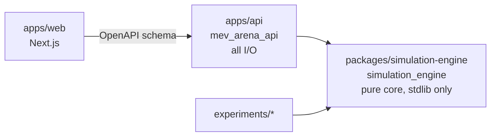

# Architecture

Spec §7 defines seven modules and a modular monolith (ADR-0001). This page says where each module lives in code
and which way imports may point. The reasoning is in [ADR-0006](decisions/0006-module-placement.md).

## Dependency rule

- `simulation_engine` imports only the Python standard library. No framework, no database client, no OpenTelemetry, no pydantic.
  Randomness is an injected seeded `random.Random`; time is a block height or timestamp passed in. Enforced by `uv run lint-imports`.
- `mev_arena_api` owns every I/O boundary: HTTP/WebSocket, PostgreSQL, Redis, Kafka, OpenTelemetry. It may import the engine; the engine never imports it.
- `apps/web` never shares Python code. It consumes the OpenAPI schema FastAPI generates.

## Module map

| Spec module | Package | Responsibility | Milestone |
|---|---|---|---|
| execution-engine | `simulation_engine.amm` | constant-product math, integer arithmetic, explicit rounding | week 2 |
| | `simulation_engine.models` | frozen dataclasses for Transaction, Block, ExecutionReceipt, AccountBalance, MarketState (spec §9) | week 2 |
| | `simulation_engine.execution` | execute an ordered block against world state; receipts; state hash | week 2 |
| | `simulation_engine.events` | domain event types and the common envelope (spec §11) | week 2 |
| | `simulation_engine.replay` | snapshot + event reapplication; state-hash verification (spec §8, §12) | week 6 (types from week 2) |
| mempool | `simulation_engine.mempool` | dedup, nonce rules, bounded queue, expiry, immutable candidate set | week 3 |
| block-builder | `simulation_engine.block_builder` | FIFO / priority-fee / random / adversarial policies; capacity; carry-over | week 3 |
| bot-swarm (strategies) | `simulation_engine.bots` | NoiseTrader, ArbitrageBot, SandwichBot as pure decision functions of (observed state, seed) | week 4 |
| bot-swarm (runner) | `mev_arena_api.bot_swarm` | drives strategies on the simulation clock and submits their transactions | week 4 |
| gateway | `mev_arena_api.gateway` | REST + WebSocket, validation, rate limit, idempotency keys, bounded client buffers | week 3–4 |
| projection | `mev_arena_api.projection` | Redis read models: price, leaderboard, mempool summary; rebuildable | week 6 |
| observability | `mev_arena_api.observability` | OpenTelemetry spans and metrics from spec §16 | week 7 |
| (runtime, not in spec list) | `mev_arena_api.simulation` | the 3-second clock: build → execute → commit → publish; pause/step/replay control | week 3 |
| | `mev_arena_api.ledger` | PostgreSQL authoritative store: blocks, receipts, balances, event log | week 6 |
| | `mev_arena_api.stream` | Kafka/Redpanda producer and consumers; outbox | week 5 |
| | `mev_arena_api.snapshot` | snapshot store | week 6 |

Engine sub-packages exist today as empty modules with a docstring. API sub-packages are created when their milestone starts.

## Engine contract

Every engine function has the shape `(state, input, seed) -> (new state, outputs)`.
No wall clock, no global random, no I/O. That is what makes "same snapshot + same events + same seed ⇒ same state hash"
a unit test instead of an integration test.
